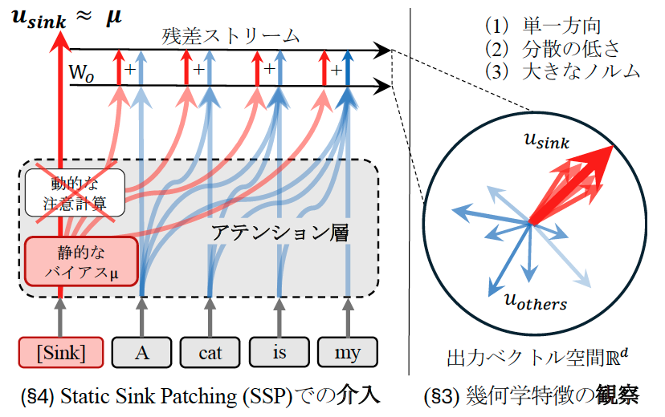

# Sink Token as Bias: Attention Sinkの解釈可能性研究

大規模言語モデル（LLM）におけるAttention Sinkトークン（主にBOSトークン）の役割と挙動を分析し、静的バイアスとしての性質を明らかにする研究用レポジトリです。

## 研究概要



本研究では、Transformer系言語モデルにおけるSinkトークンの２つの側面を分析しています：

1. **（§3）幾何学特徴の観察**: Sinkトークンの出力ベクトルが持つ特徴的な性質（単一方向・分散の低さ・大きなノルム）の分析
2. **（§4）Static Sink Patching (SSP)**: 静的なバイアスμとしてSinkトークンを介入させ、動的な注意計算を不要にする手法の検証

## プロジェクト構造

```
.
├── configs/                          # 実験設定ファイル
│   ├── gemma2_9b_base.yaml          # Gemma2-9B用設定
│   ├── llama2_7b_hf.yaml            # Llama2-7B用設定
│   ├── mistral-7B-v0.1.yaml         # Mistral-7B用設定
│   ├── qwen3_8b_base.yaml           # Qwen3-8B用設定
│   └── intervention/                 # 介入実験用設定
│       ├── llama2_7b_hf.yaml
│       ├── mistral_7b_v01.yaml
│       └── qwen3_8b_base.yaml
├── data/                             # データセット
│   ├── models.json                   # モデル情報定義
│   ├── openwebtext_n100_ml512_seed42/    # 評価データ（n=100, max_len=512）
│   ├── openwebtext_n100_ml2000_seed42/   # 評価データ（n=100, max_len=2000）
│   └── openwebtext_n100_ml3500_seed42/   # 評価データ（n=100, max_len=3500）
├── experiments/                      # 実験結果出力先
│   ├── intervention/                 # 介入実験結果
│   ├── observation_analysis/         # 観察実験結果
│   ├── sink_as_bias_llama2_7b_hf/   # Llama2実験結果
│   ├── sink_as_bias_mistral_7b_v0.1/# Mistral実験結果
│   └── sink_as_bias_qwen3_8b_base/  # Qwen3実験結果
├── notebooks/                        # 分析用Jupyterノートブック
│   ├── paper_val_update_analysis.ipynb  # Value更新分析
│   ├── visualize_sink.ipynb             # Sink可視化
│   └── viz_projection.ipynb             # 射影可視化
├── src/                              # ソースコード
│   ├── cli/                          # CLIエントリポイント
│   │   ├── sink_as_bias.py          # メイン観察実験
│   │   └── sink_intervention.py      # 介入実験
│   ├── dataio/                       # データ入出力
│   │   ├── datasets.py              # データセット処理
│   │   └── make_eval_set.py         # 評価セット作成
│   ├── models/                       # モデル関連
│   │   ├── get_internals.py         # 内部状態取得
│   │   ├── hooks.py                 # フック機構
│   │   ├── loader.py                # モデルローダー
│   │   ├── v_hook.py                # Value更新フック
│   │   └── monkey_patch/            # モデル修正パッチ
│   └── utils/                        # ユーティリティ
├── run.sh                            # 観察実験実行スクリプト
├── run_intervention.sh               # 介入実験実行スクリプト
├── make_eval.sh                      # 評価データ作成スクリプト
└── pyproject.toml                    # プロジェクト依存関係定義
```

## セットアップ

### 必要要件

- Python >= 3.12
- CUDA対応GPU（推奨：24GB以上のVRAM）
- [uv](https://github.com/astral-sh/uv) パッケージマネージャー

### インストール

```bash
# uvのインストール（未インストールの場合）
curl -LsSf https://astral.sh/uv/install.sh | sh

# 依存パッケージのインストール
uv sync
```

## 使用方法

### 1. 評価データセットの作成

```bash
bash make_eval.sh
```

または直接コマンドで：

```bash
uv run make-eval-set \
  --dataset openwebtext \
  --n_samples 100 \
  --max_length 3500 \
  --seed 42 \
  --output data/openwebtext_n100_ml3500_seed42
```

### 2. Sink観察実験の実行

Sinkトークンの幾何学的特徴（ベクトルの方向性、ノルム、分散など）を分析します。

```bash
# Qwen3-8Bモデルでの実験例
bash run.sh configs/qwen3_8b_base.yaml

# Llama2-7Bモデルでの実験例
bash run.sh configs/llama2_7b_hf.yaml
```

実行内容：

- Hidden states、Attentionパターンの抽出
- Sinkスコアの計算
- Value更新の分析
- 各種可視化（ヒートマップ、ワイヤーフレーム図）

### 3. 介入実験（Static Sink Patching）の実行

Sinkトークンを静的バイアスμで置き換え、性能への影響を測定します。

```bash
# Qwen3-8Bでの介入実験
bash run_intervention.sh configs/intervention/qwen3_8b_base.yaml

# Mistral-7Bでの介入実験
bash run_intervention.sh configs/intervention/mistral_7b_v01.yaml
```

実行内容：

- オリジナルモデルでのperplexity測定
- Sinkトークンを静的バイアスμで置換
- 介入後のperplexity測定と比較
- 残差ストリームへの影響分析

### 4. 結果の分析

実験結果は `experiments/` ディレクトリに保存されます。Jupyterノートブックで詳細な分析が可能です：

```bash
uv run jupyter lab notebooks/
```

主な分析ノートブック：

- [paper_val_update_analysis.ipynb](notebooks/paper_val_update_analysis.ipynb): Value更新の統計分析
- [visualize_sink.ipynb](notebooks/visualize_sink.ipynb): Sink特性の可視化
- [viz_projection.ipynb](notebooks/viz_projection.ipynb): 出力ベクトル空間の射影分析

## 設定ファイルの説明

YAMLファイルで実験パラメータを指定します：

```yaml
model: 'Qwen/Qwen3-8B-Base' # HuggingFaceモデル名
eval_jsonl: 'data/openwebtext_n100_ml3500_seed42/eval.jsonl' # 評価データ
out: 'experiments/sink_as_bias/qwen3_8b_base' # 出力ディレクトリ
max_total_tokens: 4096 # 最大トークン数
dtype: 'bfloat16' # データ型
device_map: 'cuda:0' # デバイス

# 分析対象レイヤーの指定
layers_to_show: [0, 1, 2, 3, 8, 9, 10, 16, 20, 23, 28, 29, 34, 35]
max_tokens_to_show: 32 # 表示する最大トークン数
max_tokens_to_calc: 512 # 計算する最大トークン数

# 実行ステップの制御
steps:
  basic: True # Hidden states, Attention, Sink Scores
  norms: True # Attn/MLP Output Norms
  values: True # Value Updates
  viz: True # Visualizations
```

## サポートされているモデル

- **Llama2** (7B): Meta Llama2アーキテクチャ
- **Mistral** (7B): Mistral-7B-v0.1
- **Qwen2/Qwen2.5/Qwen3** (7B-8B): Alibaba Qwen系列
- **Gemma2** (9B): Google Gemma2
- **Phi-4** (15B): Microsoft Phi-4
- **GPT-OSS** (20B): オープンソースGPT系モデル
- **Pythia** (6.9B): EleutherAI Pythia

## 主要な分析指標

- **Sink Score**: 各トークンがSinkとして機能する度合い
- **Value Update Magnitude**: Valueベクトルの更新量
- **Output Vector Norm**: 出力ベクトルのノルム
- **Attention Entropy**: 注意分布のエントロピー
- **Perplexity**: 言語モデルの困惑度（介入実験）

<!-- ## ライセンス

研究用途での利用を想定しています。詳細は各モデルのライセンスに従ってください。 -->

<!-- ## 引用

この研究を利用する場合は、以下を引用してください：

```bibtex
@article{ohashi2024sink,
  title={Sink Token as Bias: Understanding Attention Sink in Large Language Models},
  author={Ohashi, Satoki},
  year={2024}
}
``` -->
<!--
## 謝辞

本研究はOpenWebTextデータセットおよびHugging Face Transformersライブラリを使用しています。 -->
